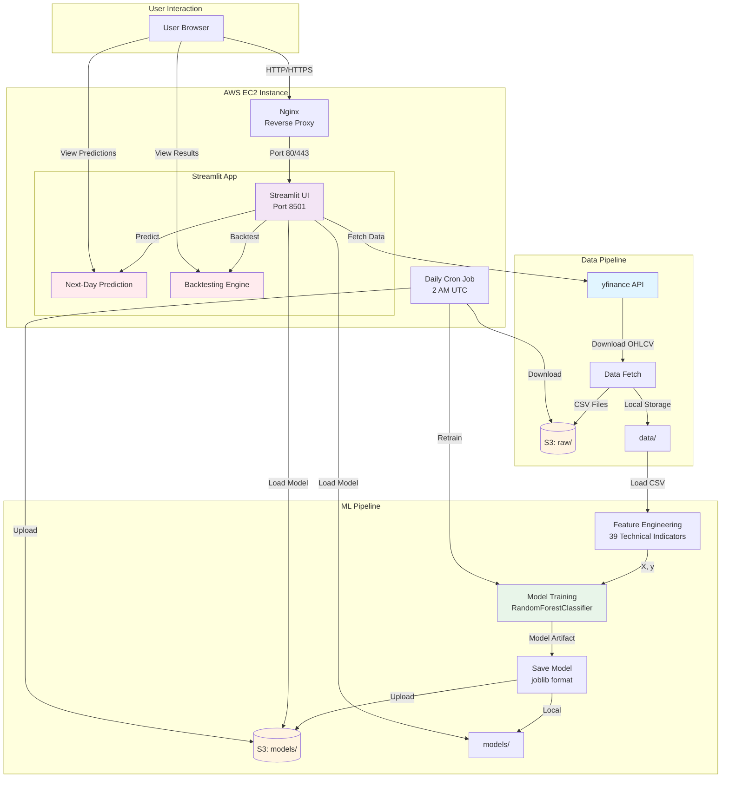

# Stock Trend Predictor

A model that predicts next-day stock price direction using yfinance data, scikit-learn models, and Streamlit UI, deployed on AWS EC2.

## Overview

- **Data Source**: yfinance (daily OHLCV)
- **Model**: RandomForestClassifier for binary classification (up/down)
- **Storage**: AWS S3 (raw/, processed/, models/, metadata/)
- **Deployment**: Single EC2 instance with systemd service
- **Retraining**: Daily cron job updates production model

## Architecture



## Repository Structure

```
stock-trend/
├── app/
│   ├── streamlit_app.py      # Streamlit UI
│   └── predict.py            # Prediction utilities
├── src/
│   ├── data_fetch.py         # yfinance downloader + S3 upload
│   ├── features.py           # Feature engineering
│   ├── train.py              # Model training script
│   ├── model_utils.py        # Model persistence utilities
│   └── eval.py               # Model evaluation
├── infra/
│   ├── ec2-user-data.sh      # EC2 bootstrap script
│   └── streamlit.service      # systemd unit file
├── deploy/
│   └── deploy.sh              # Deployment script
├── scripts/
│   └── daily_retrain.sh       # Daily retraining cron job
├── tests/                     # Test files
└── sample_data/               # Sample CSV for offline testing
```

## Local Development

### Setup

```bash
# Create virtual environment
python3 -m venv venv
source venv/bin/activate  # On Windows: venv\Scripts\activate

# Install dependencies
pip install -r requirements.txt
```

### Data Fetching

```bash
# Download data for a single ticker
python src/data_fetch.py --ticker AAPL --start 2018-01-01 --end 2024-12-31 --out data/

# Download multiple tickers from file
python src/data_fetch.py --tickers-file tickers.txt --start 2018-01-01 --end 2024-12-31 --out data/
```

### Training

```bash
# Train model on processed data
python src/train.py --data data/AAPL-2018-01-01-2024-12-31.csv --out models/

# Train and upload to S3
python src/train.py \
    --data data/AAPL-2018-01-01-2024-12-31.csv \
    --out models/ \
    --s3-bucket my-stock-models \
    --s3-key models/production.joblib
```

### Backtesting

```bash
# Backtest a model on historical data
python src/eval.py \
    --model models/AAPL_model.joblib \
    --data data/AAPL-2020-01-01-2024-12-31.csv \
    --start 2023-01-01 \
    --end 2024-12-31 \
    --plot

# Or use the example script
python scripts/backtest_example.py \
    --model models/AAPL_model.joblib \
    --data data/AAPL-2020-01-01-2024-12-31.csv \
    --plot
```

### Running Streamlit App

```bash
streamlit run app/streamlit_app.py
```

The app will be available at `http://localhost:8501`

**Features:**
- Load models from local files or S3
- Download stock data for any ticker
- View historical price charts
- See computed features
- Make next-day predictions with probabilities
- Backtesting with performance metrics and visualizations
- Model comparison across multiple models
- Prediction history tracking with CSV export

## AWS Deployment

**📖 For complete deployment instructions, see [DEPLOYMENT.md](DEPLOYMENT.md)**

### Quick Start

1. **Create S3 Bucket**
   ```bash
   aws s3 mb s3://your-stock-models-bucket --region us-east-1
   ```

2. **Launch EC2 Instance**
   - AMI: Ubuntu 22.04 LTS
   - Instance Type: t3.medium or larger
   - IAM Role: Attach role with S3 permissions
   - User Data: Paste contents of `infra/ec2-user-data.sh`
   - Security Group: Allow ports 22, 80, 443, 8501

3. **SSH and Configure**
   ```bash
   ssh -i your-key.pem ubuntu@<EC2_IP>
   cd ~/stock-trend-mvp
   # Follow manual setup in DEPLOYMENT.md if user-data didn't run
   ```

4. **Set Environment Variables**
   ```bash
   export S3_BUCKET="your-stock-models-bucket"
   export AWS_DEFAULT_REGION="us-east-1"
   ```

5. **Configure Nginx** (see `infra/nginx.conf`)

6. **Set Up Daily Retraining**
   ```bash
   crontab -e
   # Add: 0 2 * * * /home/ubuntu/stock-trend-mvp/scripts/daily_retrain.sh >> /var/log/stock-trend/retrain.log 2>&1
   ```

### Deploy Updates

```bash
# Using deploy script
./deploy/deploy.sh <EC2_IP>

```

### Deployment Checklist

See [DEPLOYMENT_CHECKLIST.md](DEPLOYMENT_CHECKLIST.md) for complete checklist.

## Environment Variables

- `AWS_DEFAULT_REGION`: AWS region (default: us-east-1)
- `S3_BUCKET`: S3 bucket name (required for S3 operations)
- `STREAMLIT_PORT`: Streamlit port (default: 8501)

## Model Artifact Structure

Saved model artifacts (joblib format) contain:
- `model`: Trained RandomForestClassifier
- `scaler`: StandardScaler for feature normalization
- `feature_cols`: List of feature column names
- `meta`: Metadata (ticker, training date, accuracy, etc.)

## Testing

```bash
# Run tests
pytest tests/
```

## Notes

- All timestamps stored in UTC
- Market hours mapped to US/Eastern
- No AWS credentials in code; uses instance role or environment variables
- Sample data included in `sample_data/` for offline testing

